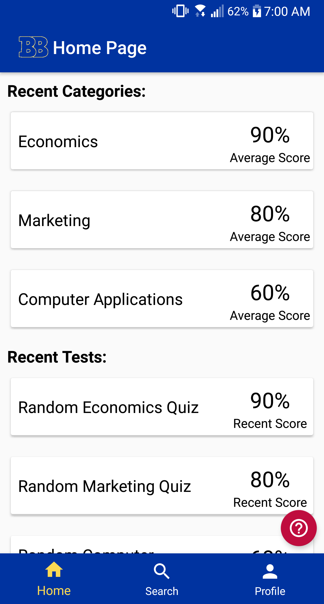
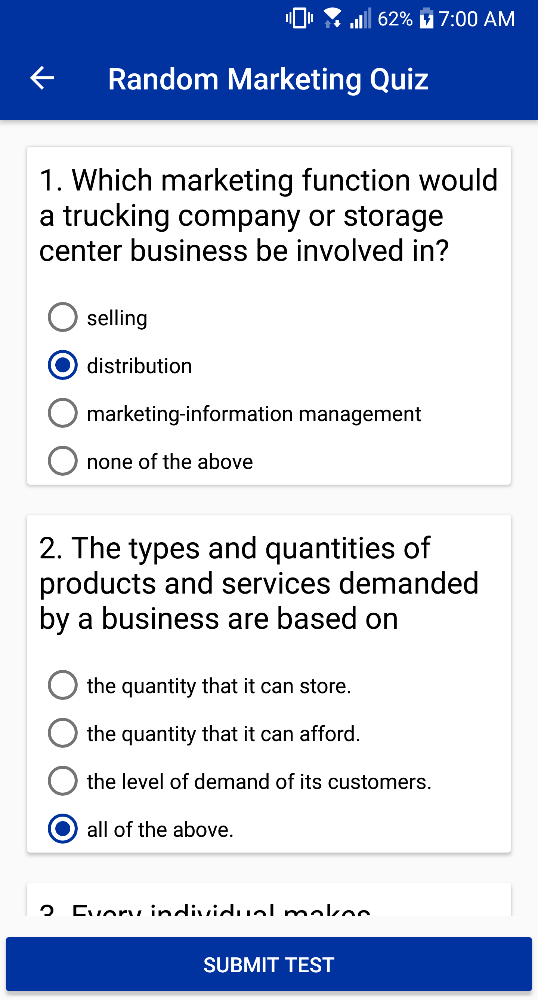
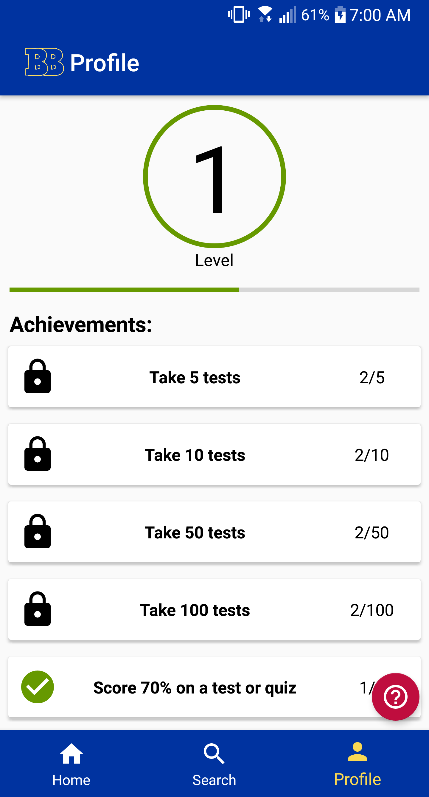

# Business Buddy
The ultimate app for testing and improving your FBLA knowledge

  

Full set of GUI Screenshots can be found here: [screenshots.pdf](screenshots.pdf)

### Running the app
To install the app on your phone, you can either build the app through Android Studio or transfer the apk file found  [here](https://github.com/YousefHaggy/FBLA-Mobile-App/raw/master/apk/BusinessBud.apk) to your phone and open it.
#### Method 1: Running the app on an external device by downloading the apk
1. Open this exact webpage on your android phone's browser [https://github.com/YousefHaggy/FBLA-Mobile-App/blob/master/README.md](https://github.com/YousefHaggy/FBLA-Mobile-App/blob/master/README.md)
2. Click [here](https://github.com/YousefHaggy/FBLA-Mobile-App/raw/master/apk/BusinessBud.apk) to download the apk file to your device. If your phone is on Android 8.0 or higher, you'll be prompted to allow your browser to install APKs
3. If your phone is on Android 7.0 or lower and you haven't already enabled installation from unknown sources, you will prompted to goto the settings app and enable it. 
4. Open the downloaded file to install the app
### Project Installation Instructions for Android Studio
Android Studio can be downloaded to your computer from [this link](https://developer.android.com/studio/?gclid=Cj0KCQjwg73kBRDVARIsAF-kEH_QSh761Oi_tirruUVzvCp4fIgIfwK-IYDOKm7aFY2psSiQfkwW3voaAuuCEALw_wcB)
1. Download the zip file  from this link here: [Project Zip File](https://github.com/YousefHaggy/FBLA-Mobile-App/archive/master.zip)
2. Unzip the content into a new folder
3. Launch Android Studio, select 'Open an existing Android Studio project", navigate to the folder created in step 2. and select the folder "FBLA-Mobile-App-master". If a different project is already open in Android Studio, select "file" from the toolbar, then select "Open..." and navigate to the aforementioned folder.

Code files can be found in the "app/src/main/java/com/yousefhaggy/fblamobileapp/" directory or you can view them by going [here](app/src/main/java/com/yousefhaggy/fblamobileapp/)

### Key Features
 - Over 2000 official FBLA questions spanning across 25 tests and 15 categories
 - Taking tests is seamless with a custom UI that provides smooth navigation between questions
 - Easily share test scores with an integrated tweet button
 - Leveling and Achievement system that motivates users to continue using the app
 - Automatic bug and crash reporting as well as the option to manually report bugs
 - Ability to generate random quizzes for any category
 - Ability to view recent test scores as well as average category scores 

